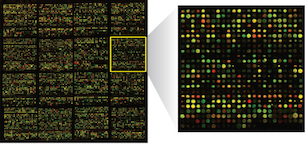

# Microarray

*Use this dataset to demonstrate parallel processing with the Launcher and Jobs features*

## Getting started

Use `start_here.R` to analyze 7000 genes in three different modes:

* `run_interactive.R` runs locally in sequence
* `run_localjobs.R` runs in three parallel local jobs
* `run_launcherjobs.R` runs in three parallel launcher jobs

## Background

DNA microarrays are used are used to measure the expression levels of large numbers of genes simultaneously. These experimental data come from [yeast genome microarrays](https://www.pnas.org/content/pnas/97/7/3364.full.pdf) and can be [downloaded here](http://genome-www.stanford.edu/swisnf/). Our models borrow from the methodology offered in [Assessing Gene Significance from cDNA Microarray Expression Data via Mixed Models](https://pdfs.semanticscholar.org/608a/4dc9f2464942030cb860a84ddcb215691188.pdf?_ga=2.38984291.1957266298.1552698540-1237907384.1552698540).

