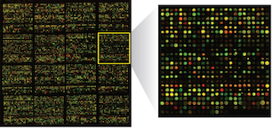

# Microarray

*Use this dataset to demonstrate parallel processing with the Launcher and Jobs features*



DNA microarrays are used to measure the expression levels of large numbers of genes simultaneously. These experimental data come from [yeast genome microarrays](https://www.pnas.org/content/pnas/97/7/3364.full.pdf) and can be downloaded [here](http://genome-www.stanford.edu/swisnf/). In this analysis we use a two stage mixed model approach as described in [here](https://pdfs.semanticscholar.org/608a/4dc9f2464942030cb860a84ddcb215691188.pdf?_ga=2.38984291.1957266298.1552698540-1237907384.1552698540). In the first stage, a mixed model normalizes the data. In the second stage, we build independent models for each gene. **We compute approximately 7,000 models in all, one for each gene**.

## Getting started

Use the code below to build the models and assess the significant interactions. For a full discussion see `full_demo.Rmd`. This code will take about 8 minutes to run on a server.

*sequential.R*

```{r}
library(dplyr)
library(lme4)
library(emmeans)
library(purrr)

normdat <- readRDS("microarray.rds")

g <- normdat %>% distinct(gene) %>% pull

# Fit Model

models <- map(g, ~ try(lmer(resid ~ strain + (1|spot:array), filter(normdat, gene == .x))))

# Pairwise Comparisons

pairs <- map(models, ~ emmeans(.x, pairwise ~ strain)$contrasts %>%
               as_tibble %>%
               mutate(contrast = as.character(contrast)))

# Collect Results

pvals <- bind_rows(pairs)
```

## Using jobs

Because these models are independent, you can also parallelize the model fitting with the [Jobs feature](https://blog.rstudio.com/2019/03/14/rstudio-1-2-jobs/) in RStudio v1.2. See `jobs.R` for an example.

*runjobs.R*

```{r}
library(rstudioapi)

jobs <- 3
n <- length(g)
n <- 300 # for faster running jobs

inds <- split(1:n, cut(1:n, jobs))
envs <- paste0("u", 1:jobs)

for(i in 1:jobs){
  ind <- inds[[i]]
  jobRunScript("job.R", 
               workingDir = ".", 
               importEnv = TRUE, 
               exportEnv = envs[i])
}
```

*job.R*

```{r}
library(dplyr)
library(lme4)
library(emmeans)
library(purrr)

# Fit Model ----

models <- map(g[ind], ~ tryCatch({
  print(.x)
  lmer(resid ~ strain + (1|spot:array), filter(normdat, gene == .x))
  }, error=function(e) cat("ERROR :",conditionMessage(e), "\n"))
  )

# Pairwise Comparisons ----

pairs <- map(models, ~ tryCatch({
  emmeans(.x, pairwise ~ strain)$contrasts %>%
               as_tibble %>%
               mutate(contrast = as.character(contrast))
  }, error=function(e) cat("ERROR :",conditionMessage(e), "\n"))
  )

# Collect Results ----

pvals <- tryCatch({
  bind_rows(pairs)
}, error=function(e) cat("ERROR :",conditionMessage(e), "\n")
)
```
